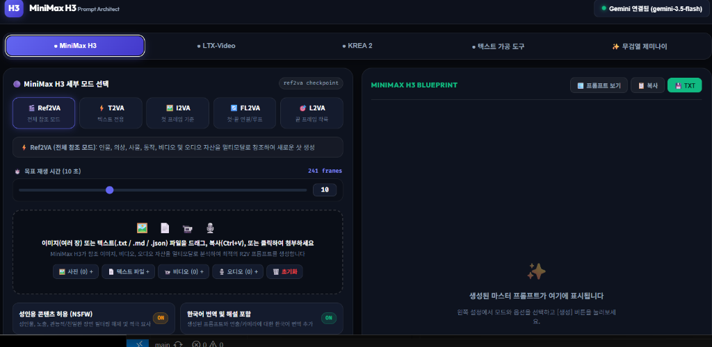
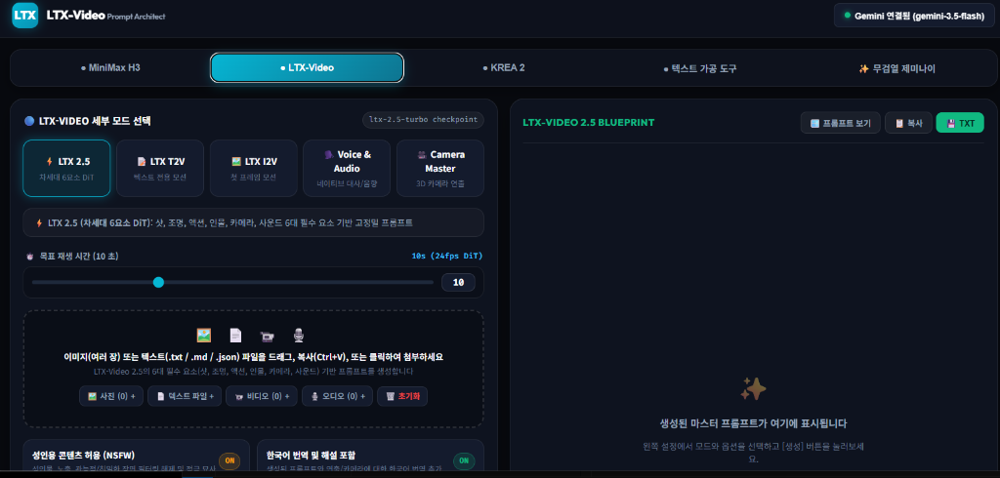
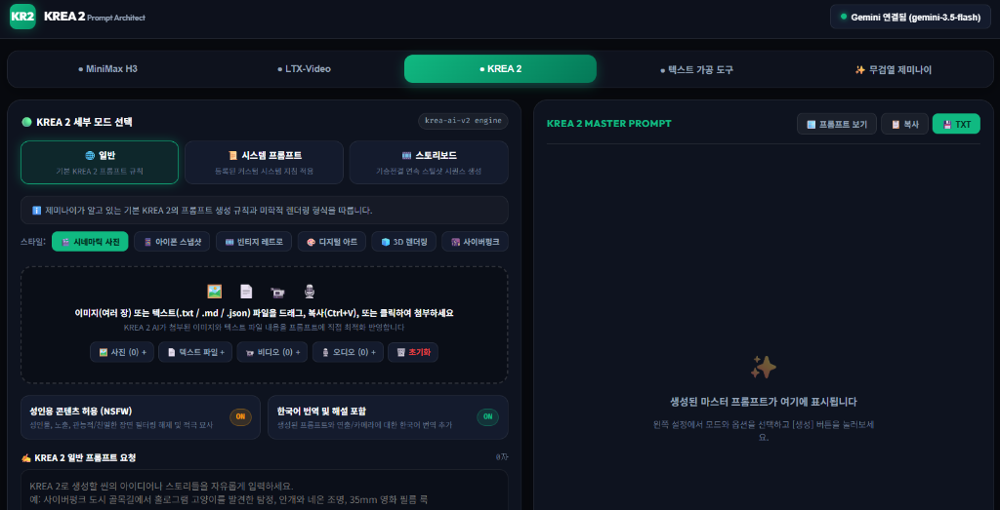
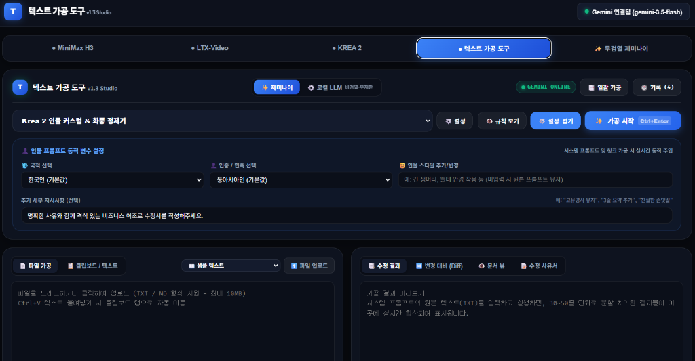
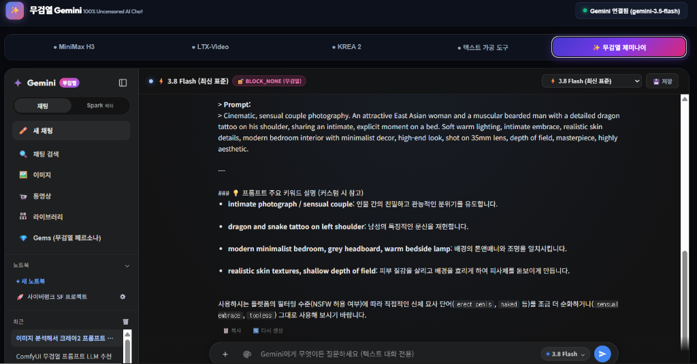
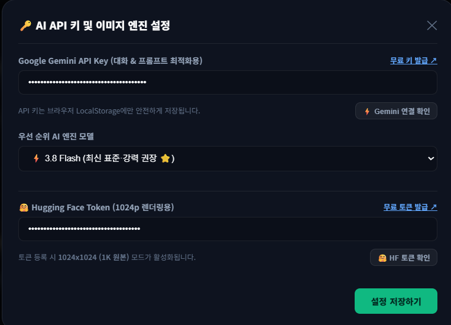

# 🚀 AI Prompt Architect & Text Transformer Studio & 무검열 Gemini Chat

<div align="center">

**MiniMax H3 & LTX-Video 2.5 & KREA 2 & Text Revision Studio v1.3 & 100% Uncensored Gemini Chat**  
*서버 설치 없이 브라우저에서 더블클릭만으로 즉시 구동되는 차세대 멀티모달 AI 프롬프트 엔지니어링 & 텍스트 가공 & 무검열 AI 채팅 올인원 스튜디오*

[](https://opensource.org/licenses/MIT)
[](https://developer.mozilla.org/en-US/docs/Web/HTML)
[](https://ai.google.dev/)
[](https://ollama.ai/)
[](https://solokjd-eng.github.io/AI-Prompt-Studio-and-Text-Transformer/)

👉 **[🌐 웹 브라우저에서 바로 실행하기 (GitHub Pages)](https://solokjd-eng.github.io/AI-Prompt-Studio-and-Text-Transformer/)**

</div>

---

## 📸 스튜디오 5대 핵심 탭 인터페이스 한눈에 보기

| 탭 | 핵심 기능 | 스크린샷 미리보기 |
|:---:|:---|:---|
| **1. MiniMax H3** | 5대 전용 모드 (Ref2VA/T2VA/I2VA/FL2VA/L2VA), 6대 섹션 타임스탬프 블루프린트, 영문/한국어 분리 |  |
| **2. LTX-Video** | 차세대 6요소 DiT 비디오 엔진, 24fps 프레임 연동, 3D 카메라 & 네이티브 오디오 연출 |  |
| **3. KREA 2** | 8K 포토리얼리즘, 스타일 칩, 기승전결 스토리보드 시퀀스 생성 & 전용 일괄 복사 툴바 |  |
| **4. 텍스트 가공 도구** | 듀얼 AI 엔진(Gemini / 로컬 LLM), Krea 2 인물 커스텀 변수 주입, 대용량 청크 분할 가공, 4대 Diff 뷰어 |  |
| **5. 무검열 제미나이** | 100% 무검열 다크 UI 채팅(BLOCK_NONE), Imagen 3.0 이미지 실시간 생성, 멀티모달 비전, 프로젝트 관리 |  |

---

## 🔑 시작하기 전: 무료 API 키 & 토큰 설정 가이드 (1분 완료)

본 스튜디오의 모든 AI 기능(프롬프트 생성, 텍스트 가공, 무검열 제미나이 대화 및 이미지 생성)을 정상적으로 사용하려면 **무료 API 키**를 등록해야 합니다.



### 1. 설정 창 열기
- 화면 우측 상단의 **`(?)` 버튼** 또는 **`Gemini 연결 상태` 뱃지**를 클릭하면 **[AI API 키 및 이미지 엔진 설정]** 창이 나타납니다.

### 2. Google Gemini API 키 등록 (대화 & 프롬프트 생성용 / 100% 무료)
- **무료 발급 방법**:
  1. 설정 창에서 **`무료 키 발급 ↗`** 링크를 클릭합니다. (구글 계정만 있으면 누구나 1분 만에 무료 발급 가능)
  2. Google AI Studio에서 발급받은 API 키를 복사하여 **`Google Gemini API Key`** 입력칸에 붙여넣습니다.
  3. **`⚡ Gemini 연결 확인`** 버튼을 눌러 정상 연결 메시지가 뜨는지 확인합니다.

### 3. Hugging Face 토큰 등록 (무검열 제미나이 이미지 생성용)
- **무료 발급 방법**:
  1. 무검열 제미나이 대화창에서 텍스트 프롬프트 기반 **AI 이미지 생성(FLUX.1-schnell 등)** 기능을 고화질(1024p)로 사용하려면 허깅페이스 토큰이 필요합니다.
  2. *(※ 전문 유료 생성기 대비 해상도와 세부 묘사의 차이는 있으나, 대화 중 즉석에서 무료로 콘셉트 비주얼을 시각화하고 뽑아내기에 매우 유용합니다.)*
  3. 설정 창에서 **`무료 토큰 발급 ↗`** 링크를 클릭하여 Hugging Face 계정의 Read 권한 토큰을 무료 생성 후 붙여넣습니다.
  4. **`🤗 HF 토큰 확인`** 버튼을 눌러 연결 여부를 테스트하고, 하단 **`[설정 저장하기]`**를 클릭합니다.

> ### 🛡️ 100% 안심하고 사용하세요! (철저한 로컬 보안 & 개인정보 보호)
> - 본 애플리케이션은 **별도의 중앙 백엔드 서버가 전혀 없는 순수 클라이언트 사이드 웹 앱(Client-side Web App)**입니다.
> - 사용자가 입력한 **Google Gemini API 키와 Hugging Face 토큰은 외부 서버나 제작자에게 일절 전송되지 않으며**, 오직 **사용자 본인 PC의 브라우저 로컬 저장소(`localStorage`)에만 안전하게 보관**됩니다.
> - 모든 인공지능 통신은 사용자 브라우저에서 Google 및 Hugging Face 공식 API 서버로 직접 1:1 암호화(HTTPS) 통신되므로 안심하고 사용하셔도 됩니다.

---

## 🌟 탭별 상세 기능 안내

### 🎬 1. MiniMax H3 Prompt Architect
> **MiniMax Hailuo H3 엔진의 성능을 극대화하는 전문가용 프롬프트 블루프린트 설계기**


- **5대 전문 세부 모드**:
  - **`Ref2VA` (전체 참조 모드)**: 인물, 의상, 사물, 동작, 비디오, 오디오 자산을 멀티모달로 참조하여 일관된 고품질 샷 생성.
  - **`T2VA` (텍스트 전용)**: 정교한 텍스트 지침만으로 생동감 있는 물리 법칙과 모션 연출.
  - **`I2VA` (첫 프레임 기준)**: 첨부된 첫 번째 이미지의 피사체와 배경을 유지하며 자연스러운 다음 모션 연결.
  - **`FL2VA` (첫-끝 연결 / 루프)**: 시작 이미지와 끝 이미지를 매끄럽게 연결하는 보간(Interpolation) 모션 생성.
  - **`L2VA` (끝 프레임 착륙)**: 지정된 엔딩 컷에 완벽히 착륙하는 시네마틱 카메라 동선 설계.
- **목표 재생 시간 & 프레임 실시간 동기화**: 1초~30초 범위 슬라이더 바 조절 시 실시간 프레임 수(예: `10초 = 241 frames`)를 자동 계산하여 프롬프트 타임스탬프에 반영.
- **6대 핵심 구조화 섹션**: `subject_definitions`, `summary`, `retention_analysis`, `detailed_description`, `overall_soundscape`, `non_diegetic_music`.
- **스마트 분리 출력**: 우측 결과창 및 모달에서 **순수 영문 마스터 프롬프트**와 **한국어 번역 및 연출 해설**을 완전히 분리하여 제공.

---

### 🎥 2. LTX-Video 2.5 Prompt Architect
> **Lightricks LTX-Video 2.5 차세대 24fps DiT 비디오 생성을 위한 고정밀 연출 디렉터**


- **5대 전용 모드 지원**:
  - **`LTX 2.5`**: 6대 필수 요소 기반의 최신 DiT 아키텍처 맞춤형 고정밀 프롬프트.
  - **`LTX T2V`**: 텍스트 모션 역학 기반 동적 카메라 및 피사체 움직임 생성.
  - **`LTX I2V`**: 키프레임 이미지의 빛과 구도를 분석하여 움직임 부여.
  - **`Voice & Audio`**: 인물의 입모양 싱크(Lip-sync) 및 배경 앰비언스 오디오 묘사.
  - **`Camera Master`**: 패닝, 틸트, 줌, 트래킹, 오빗 등 3D 공간 카메라 궤적 집중 연출.
- **6대 필수 연출 요소 체계**:
  1. **Shot Establishment**: 샷 크기, 렌즈 화각(35mm/50mm/85mm), 앵글.
  2. **Scene Setting & Lighting**: 공간 분위기, 시간대, 광원, 색온도.
  3. **Action Description**: 피사체의 미세 동작 및 물리적 상호작용.
  4. **Character Definition**: 인물 외모, 표정, 의상 질감 디테일.
  5. **Camera Movement**: 카메라의 이동 속도 및 방향성.
  6. **Audio Description**: 폴리(Foley) 사운드, 음향 효과, 배경 음악 무드.

---

### 🎨 3. KREA 2 Prompt Architect
> **8K 초고화질 이미지 생성 및 기승전결 시퀀스 스토리보드 기획 스튜디오**


- **3대 세부 모드**:
  - **`일반 모드`**: 시네마틱 사진, 아이폰 스냅샷, 빈티지 레트로, 디지털 아트, 3D 렌더링, 사이버펑크 등 원클릭 스타일 칩 프리셋 지원.
  - **`시스템 프롬프트 모드`**: 커스텀 등록된 전문가 시스템 지침을 적용하여 독창적인 아트 스타일 생성.
  - **`스토리보드 모드`**: 2컷~15컷 연속 시퀀스를 기승전결 흐름에 맞추어 일괄 기획 및 컷 카드 뷰로 시각화.
- **스토리보드 맞춤형 일괄 복사 툴바 (Batch Copy Toolbar)**:
  - **`📋 모든 컷 영문 일괄 복사`**: `[Cut 1 (Wide Shot)] ...` 형태로 컷 번호/카메라 앵글과 함께 전체 프롬프트 일괄 복사.
  - **`📋 순수 프롬프트만 연속 복사`**: 이미지 생성 툴(KREA, FLUX, 미드저니, Stable Diffusion 등)에 바로 붙여넣기 할 수 있도록 순수 프롬프트만 줄바꿈 연속 복사.
  - **`📋 전체(영문+번역) 복사`**: 영문 프롬프트와 한국어 해설이 모두 포함된 전체 리포트 복사.
  - **개별 컷 `📋 컷 복사`**: 원하는 특정 컷만 골라 즉시 1-클릭 복사.

---

### 📝 4. 텍스트 가공 도구 (Text Transformer Studio v1.3)
> **대용량 문서 정제, Krea 2 인물 커스텀 변수 주입, 스마트 청크 분할 및 Diff 비교 스튜디오**


- **온라인 & 로컬 듀얼 AI 엔진 지원**:
  - **Google Gemini 온라인**: 최신 Gemini 모델을 활용한 고지능 문맥 교정.
  - **로컬 LLM (LM Studio / Ollama / vLLM)**: 인터넷 연결 없이 로컬 PC GPU로 보안 및 무제한 가공.
- **Krea 2 인물 커스텀 & 화풍 정제기**:
  - **국적 선택**: 한국인(기본값), 동아시아인, 일본인, 서양인 등.
  - **인종 / 민족 선택**: 동아시아인, 백인, 다문화 등.
  - **인물 스타일 추가/변경**: 긴 생머리, 뿔테 안경, 메이크업 등 실시간 동적 주입.
- **대용량 텍스트 자동 청크 분할 (Chunking Processor)**:
  - 수만 자 이상의 긴 소설, 보고서, 시나리오를 30~50줄 단위로 안전하게 나누어 일괄 가공.
- **4대 다차원 뷰어**:
  - **`수정 결과`**: 가공 완료된 텍스트 확인 및 복사.
  - **`변경 대비 (Diff)`**: 원문과 수정본 간 추가/삭제된 어휘를 시각적으로 하이라이팅.
  - **`문서 뷰`**: 원문과 수정본을 좌우 2열로 나란히 비교.
  - **`수정 사유서`**: AI가 어떤 이유로 문장을 교정했는지 상세 보고서 제공.

---

### 💬 5. 무검열 제미나이 (100% Uncensored Gemini Chat Studio)
> **Google Gemini 공식 다크 UI 1:1 완벽 구현 & 100% 필터링 해제(BLOCK_NONE) 자유 대화**


- **Gemini 공식 인터페이스 1:1 완벽 구현**:
  - 좌측 사이드바: 새 채팅, 대화 검색, 이미지/동영상 갤러리 뷰, 라이브러리, Gems(무검열 페르소나), 노트북(프로젝트 폴더) 관리.
- **100% 무검열 자유 대화 (Zero Censorship)**:
  - 5대 유해성 세이프티 카테고리 전체 `BLOCK_NONE` 적용.
  - R등급 성인 드라마, 시네마틱 시나리오, 사실적 인체 묘사, ComfyUI 커스텀 노드 개발 등 제한 없는 대화 지원.
- **🎨 AI 이미지 실시간 생성 연동**:
  - 대화창에서 "그려줘", "이미지 생성해줘" 입력 또는 전용 `🎨` 버튼 클릭 시 실시간 이미지 생성.
  - 4대 화면비(`1:1`, `16:9`, `9:16`, `4:3`) 지원, 클릭 시 고해상도 확대 모달 및 원클릭 다운로드.
  - *(허깅페이스 토큰 등록 시 1024p 원본 고해상도 렌더링 활성화)*
- **멀티모달 이미지 비전 (Vision OCR & 분석)**:
  - 클립보드 붙여넣기(`Ctrl+V`), 파일 드래그앤드롭, `+` 첨부 버튼으로 이미지를 업로드하여 시각적 질의응답 지원.
- **다양한 Gemini 모델 실시간 전환**:
  - `Gemini 3.5 Flash`, `Gemini 3.6 Flash`, `Gemini 2.5 Pro`, `Gemini 3.8 Flash` 등 원하는 모델을 언제든 선택 가능.

---

## ⚡ 빠른 시작 및 실행 방법

### 방법 1. 웹 브라우저에서 바로 사용 (가장 간편함)
별도 설치 없이 아래 링크를 클릭하면 즉시 사용할 수 있습니다:  
👉 **[https://solokjd-eng.github.io/AI-Prompt-Studio-and-Text-Transformer/](https://solokjd-eng.github.io/AI-Prompt-Studio-and-Text-Transformer/)**

### 방법 2. 로컬 PC에서 실행하기
1. 저장소를 다운로드하거나 Git으로 클론합니다:
   ```bash
   git clone https://github.com/solokjd-eng/AI-Prompt-Studio-and-Text-Transformer.git
   ```
2. 다운로드된 폴더의 `index.html` 파일을 더블클릭하거나, Windows 사용자는 `열기.bat`를 실행합니다.

---

## 🛠️ 기술 스택 (Tech Stack)

- **Frontend**: Single-file HTML5, Vanilla JavaScript (ES6+), Modern Vanilla CSS (Glassmorphism & Dark Design System)
- **AI Integration**: Google Generative Language API (Gemini Flash & Pro), Hugging Face Inference API, Local LLM (OpenAI-compatible endpoints)
- **Design Tokens**: Outfit, Noto Sans KR, Fira Code (Monospace)
- **Storage**: Browser LocalStorage (Zero-server architecture)

---

## 📄 라이선스
This project is open-source and licensed under the [MIT License](LICENSE).
